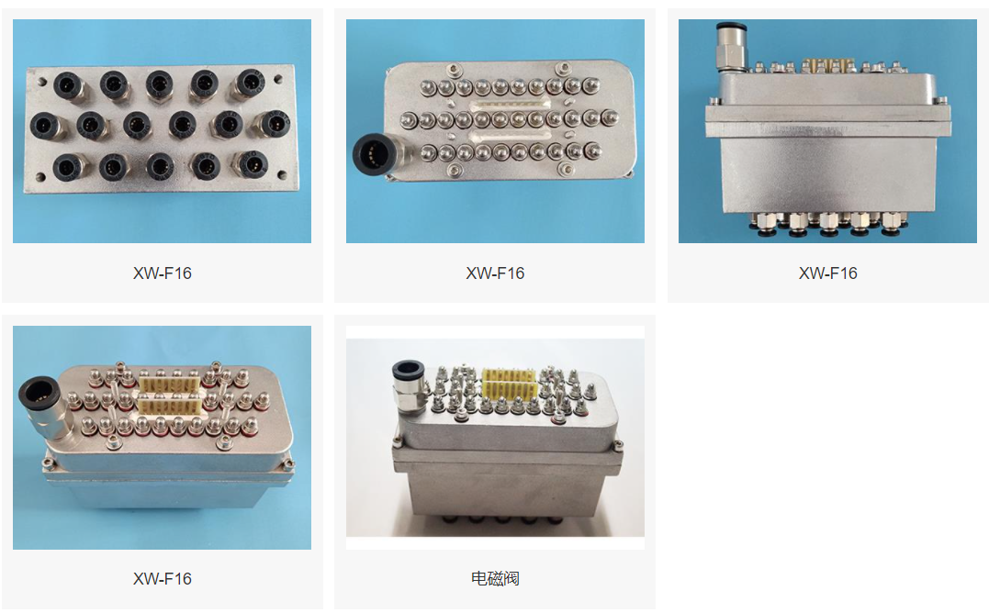

# 阀板硬件

这个文件夹下是丁坤画的48路阀板的原理图和PCB，用于烟梗分选机。整个机器用了六块48路阀板，驱动256路喷嘴，阀的型号是合肥旭伟电子气动有限公司的XW-F16，这个阀一个可以连接并控制16个喷嘴。每个阀的电阻是14欧姆，高压启动时峰值电流约1.5A，低压保持电流约0.8A。

## 概述

48个电磁阀连接在顶部的12个接口上，当接口上有电压时电流流过电磁阀，电磁阀打开。由于电磁阀工作需要大电流大电压且为感性器件，容易影响发出控制信号的CPLD芯片，因此需要独立且隔离的电源，这个电源标为`LOW`，参考为`PGND`。为加快电磁阀开启，在开启瞬间会输出一个高电压，这是另一个独立的电源，标为`HIGH`，参考也为`PGND`。这个高电压会在电磁阀开启后被断开，随后施加标号为`LOW`的保持电压，用来保持电磁阀的打开状态。需要电磁阀关闭则切断保持电压。

上面的过程由光耦隔离驱动端MOS和控制芯片CPLD，提供给光耦输出端的电压标号为`+12V`，参考为`PGND`。

上述提及的`LOW`、`HIGH`、`PGND`、`+12V`仅为板子的丝印上的称呼，都在右上角电源接口输入。

CPLD为控制芯片，接收外部信号并将控制信号输出到板上的光耦，数字电路部分和光耦输入端的电源标号为`DGND`、`+12V`，仅为板子的丝印上的称呼，都在右下角电源接口输入，当然，输入的12V会转换为3.3V提供给数字电路。

设计时是按照下表电压来做的

| 丝印 | 电压    |
| ---- | ------- |
| LOW  | 12~24V  |
| HIGH | 24~100V |
| PGND | 0V      |
| +12V | 12V     |
| DGND | 0V      |
| +12V | 12V     |

本次所用的阀板加速开启用的高电压为直流100V、保持用的低电压为直流12V

## 调试

**版号**

在`INFO`丝印标志的区域有`S1`、`S2`、`S3`、`S4`标注的0欧电阻焊接位，按`0`、`1`标注焊接即可，注意0和1不能都焊。这个设置是为阀板级联做的冗余。

**烧录**

CPLD烧录口为简牛口，用USB Blaster烧录的，开发软件为Quartus。旁边的按键是复位信号按键，说白了就是复位按键。用`TTL`接口可以方便单端信号的调试

**观察开关量**

在正面那排光耦前有LED，打开的阀门那一路对应的LED亮。选用LED和串联限流电阻时，查看[issue#2](https://github.com/NanjingForestryUniversity/valveboard/issues/2)

**电源**

数字电源输入为12V，在板子上转换为3.3V，网络标号+3.3V，为防止电磁阀上电瞬间直接误动作，因此给光耦电源加入RC延时电路，输出标号为+3.3VGG，按设计延时约500ms，这个时间远大于CPLD初始化开始工作的时间，因此电磁阀上电瞬间不会误动作。此外还添加了防反接保护，查看[issue#3](https://github.com/NanjingForestryUniversity/valveboard/issues/3)

## 生产制造

所需器件BOM里都有，板子开窗部分要加锡，钢网上已经体现了。测试板子是嘉立创做的，SMT也是嘉立创，直插元件和芯片需手焊

## Changelog

丁坤2019年9月入学、丁坤QQ1091546069、丁坤电话17761700156，他刚入学时就被师兄叫去焊接汪学良的阀板，后来接替师兄做了这个仓库里的阀板，作者已经毕业，但很乐意解答有关的所有问题

### v1.0 

绿色的阀板，测试版本，继承于远古的原理图和布局

### v1.1

蓝色的阀板，丁坤画，具有ISO、LVDS、TTL接口，见[b01-h1.1-p1.1-f1.1](https://github.com/NanjingForestryUniversity/valveboard/releases/tag/b01-h1.1-p1.1-f1.1)

### v1.2

黄色的阀板，见 [b02-h1.2-p1.1-f1.2](https://github.com/NanjingForestryUniversity/valveboard/releases/tag/b02-h1.2-p1.1-f1.2)

- 采用带屏蔽的超六类RJ45端口代替原来的牛角座，增强了通信的稳定性
- 删除了ISO（隔离）端口
- 删除了LVDS的BYPASS端口
- 删除了TTL端口
- 修改电磁喷阀的接口为更容易买到的器件，[器件详情](https://detail.tmall.com/item.htm?spm=a230r.1.14.52.2b5b4e50D2a4NS&id=633917290163&ns=1&abbucket=5&skuId=4696862330457)
- 增加了光隔数字部分电源的延迟上电电路，避免启动瞬间喷阀动作
- 修改了1N4148的封装为SOD-123，方便SMT
- 略微优化了板子尺寸，调整了安装孔位置和个数

### v1.3

绿色的阀板，见[b02-h1.3-p1.1-f1.3](https://github.com/NanjingForestryUniversity/valveboard/releases/tag/b02-h1.3-p1.1-f1.3)

- 重画了原理图和PCB，PCB尺寸减小
- 增大阻容器件封装，解决100V耐压风险，[issue#1](https://github.com/NanjingForestryUniversity/valveboard/issues/1)
- LED改为黄绿色，[issue#2](https://github.com/NanjingForestryUniversity/valveboard/issues/2)
- 添加了数字电源防反接，[issue#3](https://github.com/NanjingForestryUniversity/valveboard/issues/3)
- 取消了所有保险丝
- 增加了每一路的标识丝印，南林的徽标
- 重新排列了阀的连接器，方便插拔
- 有需要的线路上增加了开窗，提高载流能力
