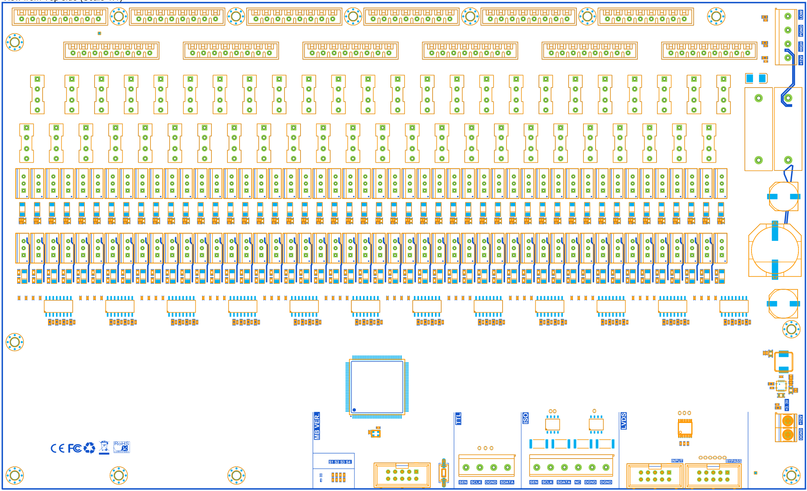

# 阀板硬件

这是48路阀板的原理图和PCB，是Altium Designer工程，原理图抄袭改进了老倪的老板子，老板子据他说是抄的德国的板子

## 概述

48个电磁阀连接在顶部的12个接口上，当接口上有电压时电流流过电磁阀，电磁阀打开。由于电磁阀工作需要大电流大电压且为感性器件，容易影响发出控制信号的CPLD芯片，因此需要独立且隔离的电源，这个电源标为`LOW`，参考为`PGND`。为加快电磁阀开启，在开启瞬间会输出一个高电压，这是另一个独立的电源，标为`HIGH`，参考也为`PGND`。这个高电压会在电磁阀开启后被断开，随后施加标号为`LOW`的保持电压，用来保持电磁阀的打开状态。需要电磁阀关闭切断保持电压。

上面的过程由光耦隔离驱动端MOS和控制芯片CPLD，提供给光耦输出端的电压标号为`+12V`，参考为`PGND`。

**上述提及的`LOW`、`HIGH`、`PGND`、`+12V`仅为板子的丝印上的称呼，都在右上角电源接口输入。**

CPLD为控制芯片，接收外部信号并将控制信号输出到板上的光耦，数字电路部分和光耦输入端的电源标号为`DGND`、`+12V`，**仅为板子的丝印上的称呼，都在右下角电源接口输入**，当然，输入的12V会转换为3.3V提供给数字电路。

设计时是按照下表电压来做的

| 丝印 | 电压    |
| ---- | ------- |
| LOW  | 12~24V  |
| HIGH | 24~100V |
| PGND | 0V      |
| +12V | 12V     |
| DGND | 0V      |
| +12V | 12V     |

下面是阀板正面视图。

## 通信接口

分3种，共4个，分别为`TTL`接口、`ISO`LATE接口、`LVDS`接口

用相应接口时应断开其他接口的跳线，焊接要启用的接口的跳线，跳线位置在接口或接口芯片旁边，大概长这个样子

- `TTL`接口的信号是遵循通信协议的最高3.3V的TTL信号，因此需要注意共地，各信号标号在丝印上有，这个接口仅用于测试，实际使用稳定性显然不如LVDS接口
- `ISO`LATE接口是隔离的意思，丝印上标的是`ISO`，为遵循通信协议的12~30V电平的单端信号，方便连接12~30V输出的设备，这个信号通过高速光耦后到达CPLD，所以称为隔离信号
- `LVDS`的`INPUT`接口的信号是遵循通信协议的LVDS信号，具体引脚定义自行看原理图。标为`BYPASS`的接口为`INPUT`接口的直接输出，用来级联阀板做的冗余。`BYPASS`不用时务必断开其跳线

## 版号

## 调试

**版号**

在`MB VER.`丝印标志的区域有`S1`、`S2`、`S3`、`S4`标注的0欧电阻焊接位，按`0`、`1`标注焊接即可，注意0和1不能都焊。这个设置是为阀板级联做的冗余

**烧录**

CPLD烧录口为没有标出来的那个简牛口，用USB Blaster烧录的，开发软件为Quartus。旁边的按键是复位信号按键，说白了就是复位按键。用`TTL`接口可以方便单端信号的调试

**观察开关量**

在正面那排光耦前有LED焊接位可以焊接上LED，打开的阀门那一路对应的LED亮，当然注意重新计算和焊接所需的串联限流电阻

**电源**

数字电源输入附近`3.3V`的LED亮不代表真的就是3.3V，也许是12V直接短路到了网络上。右上角电源接口附近的灯指示输入的电压。另外板子上有大量保险丝，包括右上角附近的两个黑色壳子，里面打开也是保险丝。

## 生产制造

所需器件BOM里都有，板子开窗部分要加锡，钢网上已经体现了

测试板子是嘉立创做的，SMT是作者手工做的

## 其他信息

板子上标有CE、FC、WEEE等认证，甚至在背面写上了苹果制造的小字，这些都是随手放上去的，完全没有进行过这些认证，当然也不是作者在苹果公司的时候画的。如果要了解板子工作原理，自行看原理图，原理图内的标号命名来自于老阀板，很让人不知所措，要有耐心才能看下去

**作者是丁坤，2019年9月入学、丁坤QQ1091546069、丁坤电话17761700156**，他刚入学时就被师兄叫去焊接老阀板，后来接替师兄做了这个仓库里的阀板，无论有没有毕业，都很乐意解答关于板子的所有问题

