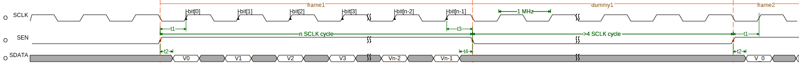
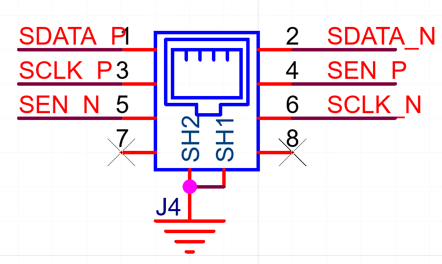
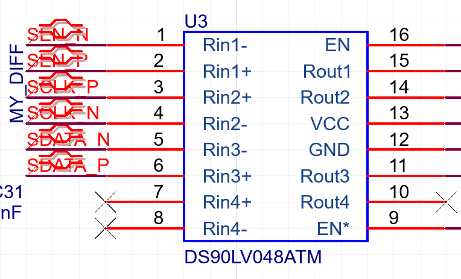
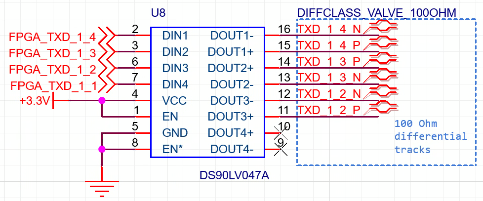

# 阀板通信协议

## 概述

由6条差分信号`SCLK+`,`SCLK-`,`SEN+`,`SEN-`,`SDATA+`,`SDATA-`

显然共计3个信号

- `SCLK`为1MHz同步时钟，周期抖动小于500ps
- `SEN`为传输状态
- `SDATA`为阀控制信号，1表示关，0表示开，小端模式

## 物理层

- LVDS差分

- 灰色排线

## 数据链路层

当需要传输一帧数据时，首先在`SCLK`的一个下降沿拉高`SEN`并建立第一个阀的控制信号V0，接收电路将在`SCLK`上升沿采样。n表示通道数，即所需控制阀门的数量，整个传输过程中，须将`SEN`拉高保持n个`SCLK`周期，期间发送n个`SDATA`阀控制信号，分别对应第1个到第n个阀。待最后一个阀的控制信号发送完成后，在`SCLK`到达下一个下降沿时，拉低`SEN`。

在两帧的间隔中，应持续保持发送1MHz的`SCLK`，接收端将通过`SCLK`的电平跳转来判断是否断开连接。另外，两帧数据的间隔应至少为5个`SCLK`周期。 

| Symbol | Parameter                | Min  | Typ  | Max  | Unit |
| ------ | ------------------------ | ---- | ---- | ---- | ---- |
| t1     | SCLK setup time          | 250  | 500  | 750  | ns   |
| t2     | Data output access time  | -    | 250  | 280  | ns   |
| t3     | SEN hold time            | 250  | 500  | 750  | ns   |
| t4     | Data output disable time | -    | 250  | 280  | ns   |

*Condition at SCLK=1MHz

下面是每一位数据的具体时序

| Symbol | Parameter              | Min  | Typ  | Max  | Unit |
| ------ | ---------------------- | ---- | ---- | ---- | ---- |
| t5     | Data output valid time | 50** | 500  | 750  | ns   |
| t6     | Data output hold time  | 250  | 500  | 750  | ns   |

*Condition at SCLK=1MHz
**Limit value

发送端须同时满足`t1`~`t5`的参数要求

## 电路

DS90LV048具有内置终端电阻，电路设计和布局布线只需注意匹配100欧姆差分阻抗

接收端

发送端

##  作者
[过奕任](https://github.com/3703781)、丁坤。老阀板的协议不明确（其实就没有协议，逆向工程后改进出来的这份协议），所以就大概描述了一下协议相关信息。欢迎提[issue](https://github.com/NanjingForestryUniversity/valveboard/issues)，bug随缘解决。

过奕任2020年入学，目前正打算找其他人接管这个库，毕业了就不要找他，但永远可以找丁坤。

丁坤2019年入学虽然已经毕业，但也很乐意解答关于这份协议的所有问题。丁坤QQ1091546069、丁坤电话17761700156。

